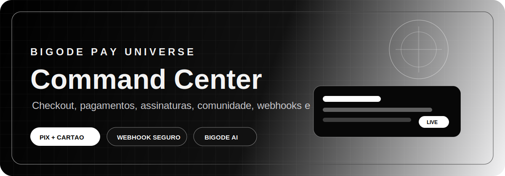
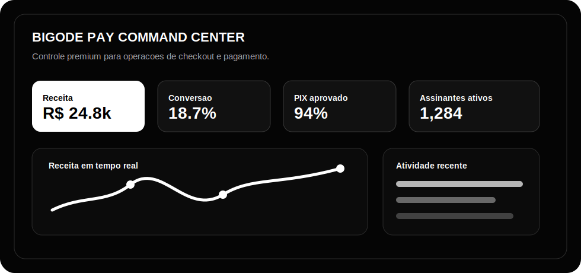
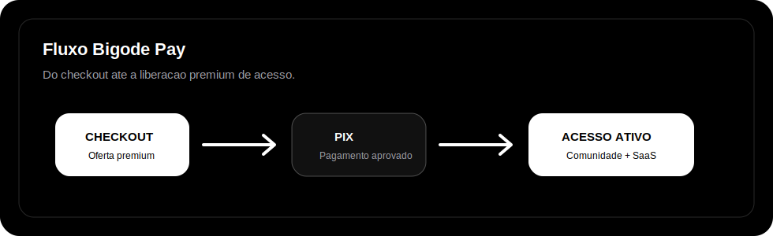

<div align="center">
  
</div>

<div align="center">
  

  <h1>Gustavo Silva</h1>

  <a href="https://git.io/typing-svg">
    
  </a>

  <p>
    Builder focado em SaaS, pagamentos, automacao, IA e produtos digitais com identidade forte.
  </p>

  <p>
    <a href="https://bigodepay.gustavogsilva06.workers.dev">
      
    </a>
    <a href="https://github.com/gustavogsilva06-bit">
      
    </a>
  </p>

  <p>
    
    
    
  </p>

  
</div>

---

<div align="center">
  
</div>

## Bigode Pay Universe

**Bigode Pay** e uma fintech SaaS premium para criadores, infoprodutores e negocios digitais venderem produtos, processarem pagamentos, acompanharem metricas, liberarem acesso por assinatura e operarem tudo em um command center.

```text
BIGODE PAY COMMAND CENTER
Controle premium para operacoes de checkout e pagamento.
```

<div align="center">

| Produto | Operacao | Marca |
| --- | --- | --- |
| Checkout premium | Dashboard com KPIs | Preto, branco e grafite |
| PIX e cartao | Receita e conversoes | Pantera negra digital |
| Planos e assinatura | Webhooks e automacoes | Experiencia SaaS premium |
| Comunidade privada | E-mail transacional | Bigode AI |

</div>

## Command Center

<div align="center">
  
</div>

<br />

<div align="center">

| Modulo | O que entrega |
| --- | --- |
| Checkout | Venda digital com experiencia rapida e premium |
| Pagamentos | Mercado Pago, PIX, cartao e status confirmado no provedor |
| Dashboard | Receita, produtos, trafego, conversoes e atividade recente |
| Assinaturas | Liberacao de acesso somente apos pagamento aprovado |
| Comunidade | Area privada para usuarios com plano ativo |
| Webhooks | Eventos assinados, integracoes e operacao automatizada |
| Bigode AI | Insights, copy, produtos e apoio operacional |

</div>

<div align="center">
  
</div>

## Stack

<div align="center">
  
  <br />
  <br />
  
  
  
  
  
  
  
</div>

## Validacoes

<div align="center">

| Status | Validado |
| --- | --- |
| Online | Deploy em Cloudflare Workers |
| Auth | Cadastro, login, logout e recuperacao de senha |
| Acesso | Bloqueio de usuario sem assinatura ativa |
| Planos | Mensal e trimestral |
| Pagamento | PIX Mercado Pago testado |
| Webhook | Assinatura e confirmacao no provedor |
| E-mail | Resend para fluxos transacionais |
| Seguranca | Headers, CORS, rate limit e protecoes iniciais |

</div>

## GitHub

<div align="center">
  
  
</div>

## Roadmap

- Dominio proprio da Bigode Pay.
- E-mail transacional com dominio verificado.
- Programa piloto com criadores e comunidades.
- Observabilidade de pagamentos e eventos.
- Painel financeiro administrativo.
- Modulos premium de IA para operacao digital.

---

<div align="center">
  

  <h3>Construindo tecnologia premium para negocios digitais.</h3>
  <p>
    <strong>Bigode Pay</strong> transforma checkout, pagamentos e operacao em um command center unico.
  </p>
</div>
